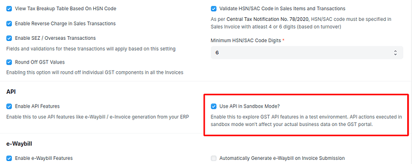

# Sandbox for India Compliance

## How to set up sandbox?

To set up the sandbox environment for India Compliance, follow these steps:

- Go to the new API section in GST Settings. Ensure that you are logged in to your India Compliance Account to access this option.
- Look for the `Use API in Sandbox Mode` toggle and enable it. This will activate the sandbox environment for testing purposes.

::: info
`ic_api_sandbox_mode`config is now deprecated and setting this config will no longer have any effect.
Your existing settings in site_config.json will be ported to the new API section in GST Settings.`
:::

## Sandbox for e-Waybill

The sandbox environment allows you to test various functionalities related to e-Waybill, but it comes with certain limitations:

- Unlike the live APIs, the sandbox does not auto-populate the distance. You will need to provide a dummy distance between 1 to 4000 km.
- If required, you can use the GSTIN 05AAACG2140A1ZL as the transporter GSTIN.
- You can use all other functionalities such as print, attach, update, or cancel as needed to test the APIs

## Sandbox for e-Invoice

You can test e-Invoice and its interaction with e-Waybill with the following restrictions (for sandbox only):

- You shall not be able to print or attach e-Waybill print. This is not possible as APIs are different with different user credentials.
- You will not be able to update the transporter or vehicle information from the sandbox.
- Other than this, you can test the generation or cancellation of e-Invoice & e-Waybill.

::: info
Please note that public APIs are not available in the sandbox mode.
:::
